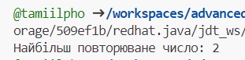

# Практична робота "Поглиблене використання масивів"

Для своєї роботи я обрала завдання 3. Знайти в матриці розміром N x M число, яке повторюється найбільшу кількість разів.

### Виконання завдання

Для свого завдання я створила два класи: Main.java та MainTest.java

У класі Main.java матриця перетворюється у одновимірний масив, потім масив сортується, і нарешті знаходиться число, що повторюється найчастіше.

````java
package src;

import java.util.Arrays;

public class Main {
    /**
     * Знаходить найбільш повторюване число в матриці.
     *
     * @param matrix матриця, в якій шукаємо найбільш повторюване число
     * @return найбільш повторюване число в матриці
     */
    public static int findMostRepeatedNumber(int[][] matrix) {
        // Отримуємо розміри матриці
        int rows = matrix.length;
        int cols = matrix[0].length;

        // Перетворюємо матрицю у одномірний масив
        int[] flatMatrix = new int[rows * cols];
        int index = 0;
        for (int i = 0; i < rows; i++) {
            for (int j = 0; j < cols; j++) {
                flatMatrix[index++] = matrix[i][j];
            }
        }

        // Сортуємо одномірний масив
        Arrays.sort(flatMatrix);

        // Знаходимо найчастіше повторюване число
        int mostRepeatedNumber = flatMatrix[0];
        int maxCount = 1;
        int currentCount = 1;
        for (int i = 1; i < flatMatrix.length; i++) {
            if (flatMatrix[i] == flatMatrix[i - 1]) {
                currentCount++;
            } else {
                if (currentCount > maxCount) {
                    maxCount = currentCount;
                    mostRepeatedNumber = flatMatrix[i - 1];
                }
                currentCount = 1;
            }
        }

        // Повертаємо найчастіше повторюване число
        return mostRepeatedNumber;
    }
}
````

MainTest.java є тестовим класом, який перевіряє роботу методу з класу Main. Він створює матрицю чисел і виводить знайдене найбільш повторюване число у консоль.

````java
package src;

/**
 * Тестовий клас для перевірки методу знаходження найбільш повторюваного числа в матриці.
 */
public class MainTest {
    /**
     * Метод main для запуску тесту.
     *
     * @param args аргументи командного рядка (не використовуються)
     */
    public static void main(String[] args) {
        int[][] matrix = {
            {2, 2, 3},
            {4, 5, 6},
            {7, 8, 9},
            {1, 2, 3}
        };

        int mostRepeatedNumber = Main.findMostRepeatedNumber(matrix);
        System.out.println("Найбільш повторюване число: " + mostRepeatedNumber);
    }
}

````


### Результат роботи програми




